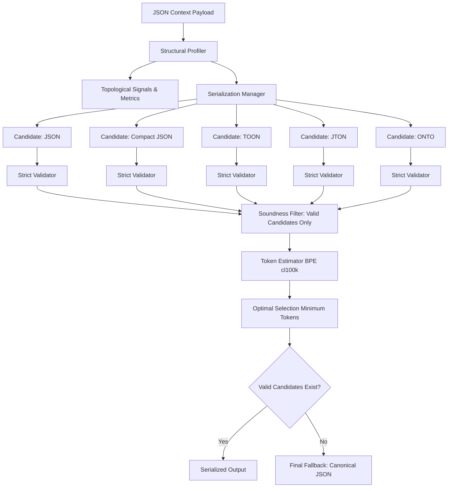

# TOONFORGE Architecture Specification

## Overview

**TOONFORGE** is an empirical research prototype and serialization framework designed to safely minimize LLM context window consumption without sacrificing semantic or structural fidelity.

> **Official Research Title**  
> *"Adaptive Structure-Aware Routing for LLM Context Serialization: An Implemented and Empirically Benchmarked Architecture Unifying JSON, TOON, JTON, and ONTO"*

---

## The Core Problem

Large Language Models (LLMs) operate over discrete token budgets where context length directly correlates with inference cost, prompt latency, and attention degradation ("lost in the middle"). Structured data in JSON format carries high syntactic overhead due to repetitive object keys, quote delimiters, indentation whitespace, and bracket hierarchies.

While alternative compact serializers (such as TOON, JTON, or ONTO) achieve significant token reduction on uniform tabular data, they introduce severe failure modes when applied indiscriminately:
1. **Silent Type Coercion**: Converting numeric strings (`"00123"`) into numbers (`123`), dropping leading zeros or changing precision.
2. **Boolean / Null Ambiguity**: Misinterpreting literal strings (`"true"`, `"false"`, `"null"`) as primitives.
3. **Structural Incompatibility**: Crashing or corrupting data when encountering non-uniform dictionaries, missing keys, or polymorphic arrays.

**Core Thesis**: *Zero data corruption takes absolute priority over token reduction.* A sound system must route payloads dynamically to the most compact representation that is strictly proven valid via automated round-trip validation, falling back to standard JSON whenever safety cannot be guaranteed.

---

## System Pipeline Architecture

### 1. Structural Profiler (`services/profiler.py`)
Extracts a 19-dimensional topological vector:
- **Hierarchical**: `max_depth`, `avg_depth`, `node_count`
- **Volume & Ratios**: `object_count`, `array_count`, `scalar_count`, `null_count`
- **Schema Regularity**: `schema_uniformity`, `heterogeneity_index`, `key_set_consistency`
- **Key Repetition**: `unique_key_count`, `key_repetition_ratio`, `key_entropy_bits_per_key`
- **Tabular Classification**: `is_tabular`, `tabular_score`

### 2. Format Implementations (`formats/`)
- **JSON**: Canonical 2-space indented baseline representation. Always eligible.
- **Compact JSON**: Stripped whitespace (`separators=(',', ':')`). Universal fallback.
- **TOON (Token-Ordered Object Notation)**: Declares schema once (`@schema`), followed by row-oriented data streams. Ideal for large uniform tabular record arrays.
- **JTON (JSON Table Object Notation)**: Hoists recurring key sets into table headers while retaining JSON structure for nested values.
- **ONTO (Object-Nesting Tuple Ordering)**: Optimized tuple notation for deeply nested recursive structures (depth >= 3).

### 3. Strict Round-Trip Validator (`services/validator.py`)
Every encoded candidate must be immediately decoded and recursively validated against the original in-memory payload:
- Strict primitive type matching (`type(a) is type(b)`)
- Strict boolean distinction (`bool` is not integer)
- String preservation (no leading zero stripping)
- Key set symmetry (no missing keys, no unexpected extra keys)
- Value equality across all nested paths

### 4. Adaptive Exhaustive Router (`services/router.py`)
Coordinates the pipeline across all 5 candidate formats. It discards ineligible or failing formats, calculates exact BPE token estimates on all valid candidates, and selects the format that maximizes token savings.

### 5. Learned Router (`services/learned_router.py`)
A fast Decision Tree Classifier trained on structural profile feature vectors. Predicts the optimal format in sub-millisecond latency (measured `~0.04–0.6ms`) versus exhaustive routing (measured `~1.7–2.2ms` on the benchmark machine — environment dependent), achieving 100% agreement on the deterministic evaluation corpus (see `docs/benchmark_methodology.md` for the canonical split methodology).
